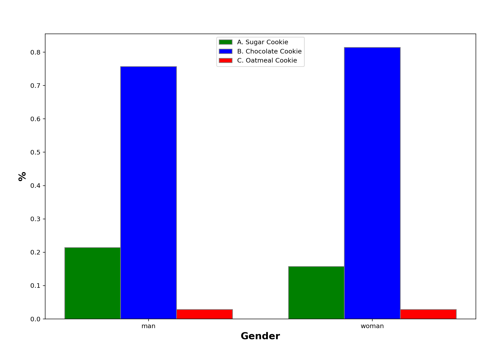

# GPT Survey Creator
This python script is used to simulate surveys using GPT-3

<hr>

## Setup
Add your OpenAI API key to the `util/helper_functions.py` file

`API_KEY = # ADD API KEY HERE`

<hr>

## Usage
Run the script with the following command
```bash
python ./survey_generator.py
```

Running the script with no arguments will generate a new survey
using the parameters described in survey_generator.py

```
# ========================= Parameters ========================================
PROMPT = """
        When taking a survey, a {category} replied to the following question.
        The question said:
         "What is your favorite kind of cookie?"
        The response options are:
        A. Sugar Cookie
        B. Chocolate Cookie
        C. Oatmeal Cookie

        They responded with: """

CHOICES = ['A. Sugar Cookie', 'B. Chocolate Cookie', 'C. Oatmeal Cookie']
CATEGORIES = ['man', 'woman']
ITERATIONS = 50
X_LABEL = 'Gender'  # For graph
TEMPERATURE = 1.0
MAX_TOKENS = 4

# =============================================================================
```

<hr>

A second option is running the script with the -i flag will run it 
in interactive mode which will let you input each of the parameters
through the command line.

```bash
python .\survey_generator.py -i
```

You will be prompted to enter each parameter. Leaving a field blank
will autofill that field with whatever value is in the corresponding
parameter variable from the survey_generator.py file.

<hr>

## Output

The script will output a graph with the results of the simulated
survey. The graph will be saved as a pdf file in the output directory.

Example:


<hr>

## Parameters

`PROMPT` The prompt that will be passed to the GPT-3 Model. Any occurrences
of `{category}` to the string will be replaced with values from the
categories list at runtime.

`CHOICES`: This list of choices should be identical to the choices provided
in the prompt. They are used to label the resulting output graph.

`CATEGORIES` This is a list of the demographics you choose to sample
in your survey. They will be used to replace the `{category}` occurrences
in the prompt field. If you don't want to have any separate categories
make sure to still put at least on item in the list so that the
survey will still run; you can use any single word as filler 
to do this (e.g. `CATEGORIES=['person']`).

`ITERATIONS` The number of times the prompt will be asked for each instance
in `CHOICES`.

`X_LABEL` The label that will be used for the X axis of the resulting graph.

`TEMPERATURE` The temperature used in the GPT-3 API call.

`MAX_TOKENS` The maximum number of tokens generated from each API call.
